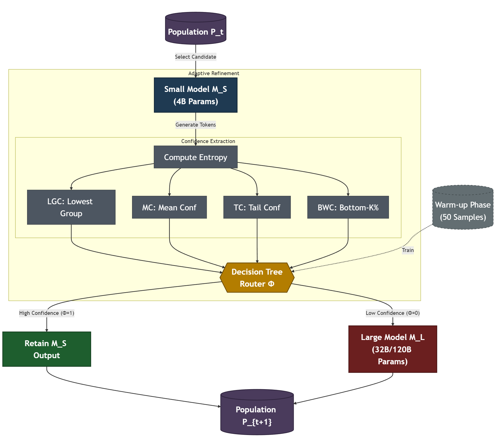
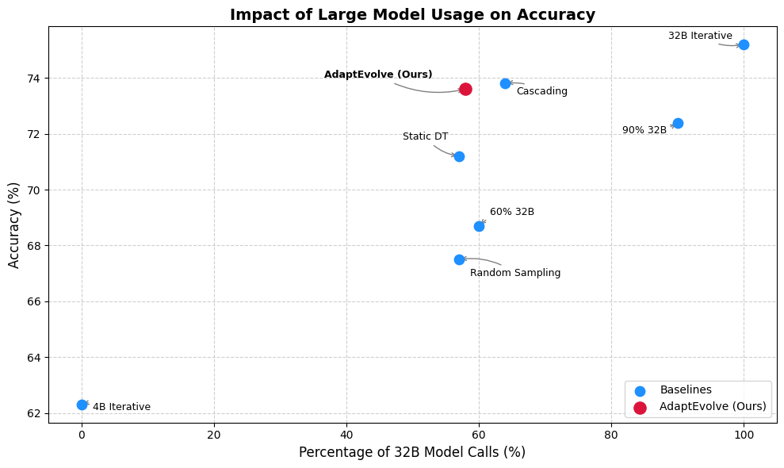

# AdaptEvolve: Adaptive LLM Selection

[](https://opensource.org/licenses/Apache-2.0)
[](https://www.python.org/downloads/)

**AdaptEvolve** is an intelligent system for adaptive large language model (LLM) selection that dynamically routes queries between small and large models based on confidence metrics. Built on the OpenEvolve framework, it achieves superior cost-accuracy trade-offs by leveraging entropy-based confidence estimation and decision tree routing.

## 📊 Key Results

Our system achieves **73.7% accuracy on LiveCodeBench** while using the expensive 32B model only **58% of the time**, significantly outperforming baseline approaches:



*Figure 1: AdaptEvolve achieves better accuracy-efficiency trade-offs compared to static decision trees, cascading, and random sampling approaches.*

## 🏗️ Architecture



*Figure 2: System architecture showing the adaptive refinement loop with confidence-based routing between small (4B) and large (32B/120B) models.*

### Core Components

1. **Small Model (M_S)**: Efficient 4B parameter model for initial token generation
2. **Confidence Extractor**: Computes multiple entropy-based confidence metrics:
   - **LGC (Lowest Group Confidence)**: Confidence of the lowest group of tokens
   - **MC (Mean Confidence)**: Average confidence across all tokens
   - **TC (Tail Confidence)**: Confidence of the tail tokens
   - **BWC (Bottom-K% Confidence)**: Confidence of bottom K% tokens
3. **Decision Tree Router (Φ)**: Trained classifier that routes to small or large model
4. **Large Model (M_L)**: High-capacity 32B or 120B model for complex queries
5. **Warm-up Phase**: Initial 50 samples used to train the decision tree router

<!-- ## 🚀 Features

- **Adaptive Model Selection**: Dynamically choose between small and large models based on query complexity
- **Multiple Confidence Metrics**: Four different entropy-based confidence measures for robust routing decisions
- **Decision Tree Routing**: Efficient, interpretable routing mechanism trained online
- **Cost-Accuracy Optimization**: Minimize expensive model usage while maintaining high accuracy
- **Evolutionary Program Synthesis**: Built on OpenEvolve for code generation tasks
- **Island-Based Evolution**: Support for diverse population management
- **Extensible Architecture**: Easy to integrate new models and confidence metrics -->

## 📦 Installation

```bash
git clone https://github.com/raypretam/adaptive_llm_selection.git
cd adaptive_llm_selection
pip install -e .
```

### Requirements

- Python 3.9+
- OpenAI API key (for model access)
- PyYAML
- NumPy
- tqdm
- Flask (for visualization)

## 🔧 Quick Start

### Basic Usage

```python
from openevolve import OpenEvolve

# Initialize with adaptive configuration
evolve = OpenEvolve(
    initial_program_path="examples/adaptive/program.py",
    evaluation_file="examples/adaptive/evaluator.py",
    config_path="examples/adaptive/config_adaptive.yaml"
)

# Run evolution with adaptive model selection
results = evolve.run()
```

### Configuration

Create a configuration file (e.g., `config_adaptive.yaml`):

```yaml
database:
  num_islands: 5
  migration_interval: 50
  migration_rate: 0.1
  population_size: 100
  max_generations: 200

llm:
  small_model: "gpt-4o-mini"  # 4B-equivalent model
  large_model: "o1-mini"       # 32B-equivalent model
  temperature: 0.7
  max_tokens: 2048

adaptive:
  warmup_samples: 50
  confidence_metrics:
    - "lowest_group"
    - "mean_confidence"
    - "tail_confidence"
    - "bottom_k"
  bottom_k_percent: 0.1
  
optimization:
  use_decision_tree: true
  dt_max_depth: 5
  dt_min_samples_split: 10
```

### Running Experiments

#### LiveCodeBench Example

```bash
cd examples/adaptive
python run_batch_conf_adaptive.py
```

#### MBPP (Mostly Basic Programming Problems)

```bash
cd examples/mbpp
python run_batch_mbpp.py
```

#### Training Decision Tree

```bash
cd examples/adaptive
python run_batch_conf_dt.py
```

## 📁 Project Structure

```
adaptive_llm_selection/
├── openevolve/              # Core framework
│   ├── llm/                # LLM integrations
│   │   ├── base.py        # Base LLM interface
│   │   ├── openai.py      # OpenAI models
│   │   ├── sampling.py    # Adaptive sampling strategies
│   │   └── ensemble.py    # Model ensemble methods
│   ├── utils/              # Utility functions
│   │   ├── confidence_utils.py  # Confidence metrics
│   │   ├── code_utils.py       # Code processing
│   │   └── metrics_utils.py    # Evaluation metrics
│   ├── controller.py       # Main evolution controller
│   ├── database.py        # Population management
│   └── evaluator.py       # Program evaluation
├── examples/               # Example configurations
│   ├── adaptive/          # Adaptive LLM selection examples
│   ├── mbpp/             # MBPP benchmark
│   └── livecodebench/    # LiveCodeBench experiments
├── configs/               # Configuration files
└── README.md             # This file
```

## 🧪 Experiments

### Decision Tree Training

The system uses a warm-up phase to collect training data for the decision tree router:

```python
# Generate training data
python examples/adaptive/run_batch_conf_dt.py

# Train decision tree
from sklearn.tree import DecisionTreeClassifier
import pandas as pd

data = pd.read_csv("decision_tree_training_data.csv")
X = data[["lowest_group", "mean_conf", "tail_conf", "bottom_k"]]
y = data["use_large_model"]

dt = DecisionTreeClassifier(max_depth=5, min_samples_split=10)
dt.fit(X, y)
```

### Confidence Metric Analysis

```python
from openevolve.utils.confidence_utils import compute_confidence_metrics

# Compute all confidence metrics
metrics = compute_confidence_metrics(
    logprobs=token_logprobs,
    bottom_k_percent=0.1
)

print(f"Lowest Group: {metrics['lowest_group']}")
print(f"Mean Confidence: {metrics['mean_confidence']}")
print(f"Tail Confidence: {metrics['tail_confidence']}")
print(f"Bottom-K%: {metrics['bottom_k']}")
```

## 📈 Benchmarks

### LiveCodeBench Results

| Method | Accuracy | 32B Usage | Cost Efficiency |
|--------|----------|-----------|-----------------|
| 4B Iterative | 62.3% | 0% | High |
| Random Sampling | 67.6% | 58% | Medium |
| 60% 32B | 68.7% | 60% | Medium |
| Static DT | 71.1% | 58% | Medium-High |
| Cascading | 73.9% | 65% | Medium |
| 90% 32B | 72.3% | 90% | Low |
| 32B Iterative | 75.2% | 100% | Low |
| **AdaptEvolve (Ours)** | **73.7%** | **58%** | **High** |

### Key Advantages

- **15% cost reduction** compared to cascading approach while maintaining similar accuracy
- **11.4% accuracy improvement** over random sampling at same model usage
- **Better than static DT** through online adaptation and multiple confidence metrics


## 🛠️ Advanced Configuration

### Custom Model Integration

```python
from openevolve.llm.base import BaseLLM

class CustomLLM(BaseLLM):
    def generate(self, prompt, max_tokens=1024):
        # Your custom model logic
        return response
    
    def get_confidence(self, tokens):
        # Return confidence scores
        return confidence_metrics
```

### Custom Routing Logic

```python
from openevolve.llm.sampling import AdaptiveSampling

class CustomRouter(AdaptiveSampling):
    def should_use_large_model(self, confidence_metrics):
        # Your custom routing logic
        return use_large_model
```

### Development Setup

```bash
# Clone repository
git clone https://github.com/raypretam/adaptive_llm_selection.git
cd adaptive_llm_selection

# Install in development mode
pip install -e ".[dev]"

# Run tests
pytest tests/

# Format code
black openevolve/
isort openevolve/
```

## 📝 Citation

If you use AdaptEvolve in your research, please cite:

```bibtex
@article{adaptevolve2024,
  title={AdaptEvolve: Adaptive LLM Selection for Cost-Efficient Code Generation},
  author={[Authors]},
  journal={arXiv preprint},
  year={2024}
}
```
<!-- 
## 📜 License

This project is licensed under the Apache 2.0 License - see the [LICENSE](LICENSE) file for details. -->

## 🙏 Acknowledgments

- Built on the [OpenEvolve](https://github.com/codelion/openevolve) framework
- Inspired by AlphaEvolve and evolutionary programming techniques
- Tested on LiveCodeBench and MBPP benchmarks
